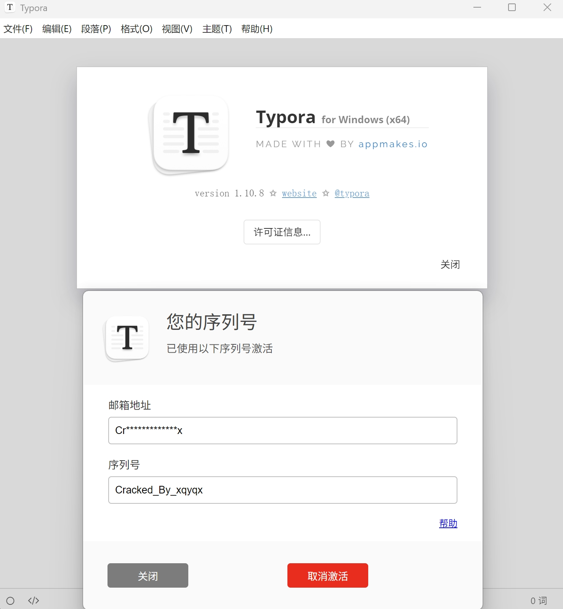

# Typora 1.10.8公钥替换

成品见[Typora通杀破解补丁](/article/3aoxkiaf/)

在最新版本中的Typora中，解包app.asar会发现软件使用了node vm将js编译成了jsc，在之前的版本中，分析atom.js可以得知Typora的激活实际上就是一个简单RSA公钥解密，只要patch了公钥就可以编写注册机进行离线激活，然而jsc中并没有简单的将公钥作为字符串进行储存（猜测是使用数组进行了解密），而分析jsc机器码又十分困难（需要自行编译定制版v8），因此可以通过native层进行公钥替换，这样不管开发者如何在js层上进行防护，都无法封堵该方法（除非定制node）

---

我们知道electron应用实际上是对node进行了打包，因此庞大的主程序里面会有node提供的所有函数，进行RSA解密需要用到`Crypto.publicDecrypt`函数，而`Crypto`模块是node使用C++编写的。

我们来到[node](https://github.com/nodejs/node)的代码仓库搜索`publicDecrypt`，可以找到接口定义(node/src/crypto/crypto_cipher.cc)：

```C++
  SetMethod(context,
            target,
            "publicDecrypt",
            PublicKeyCipher::Cipher<PublicKeyCipher::kPublic,
                                    ncrypto::Cipher::recover>);

```

向下翻，找到`PublicKeyCipher::Cipher`函数：

```c++
template <PublicKeyCipher::Operation operation,
          PublicKeyCipher::Cipher_t cipher>
void PublicKeyCipher::Cipher(const FunctionCallbackInfo<Value>& args) {
  MarkPopErrorOnReturn mark_pop_error_on_return;
  Environment* env = Environment::GetCurrent(args);

  unsigned int offset = 0;
  auto data = KeyObjectData::GetPublicOrPrivateKeyFromJs(args, &offset);
  if (!data) return;
  const auto& pkey = data.GetAsymmetricKey();
  if (!pkey) return;

  ArrayBufferOrViewContents<unsigned char> buf(args[offset]);
  if (!buf.CheckSizeInt32()) [[unlikely]] {
    return THROW_ERR_OUT_OF_RANGE(env, "buffer is too long");
  }
  uint32_t padding;
  if (!args[offset + 1]->Uint32Value(env->context()).To(&padding)) return;

  if (cipher == ncrypto::Cipher::decrypt &&
      operation == PublicKeyCipher::kPrivate && padding == RSA_PKCS1_PADDING) {
    EVPKeyCtxPointer ctx = pkey.newCtx();
    CHECK(ctx);

    if (!ctx.initForDecrypt()) {
      return ThrowCryptoError(env, ERR_get_error());
    }

    // RSA implicit rejection here is not supported by BoringSSL.
    if (!ctx.setRsaImplicitRejection()) [[unlikely]] {
      return THROW_ERR_INVALID_ARG_VALUE(
          env,
          "RSA_PKCS1_PADDING is no longer supported for private decryption");
    }
  }

  Digest digest;
  if (args[offset + 2]->IsString()) {
    Utf8Value oaep_str(env->isolate(), args[offset + 2]);
    digest = Digest::FromName(*oaep_str);
    if (!digest) return THROW_ERR_OSSL_EVP_INVALID_DIGEST(env);
  }

  ArrayBufferOrViewContents<unsigned char> oaep_label(
      !args[offset + 3]->IsUndefined() ? args[offset + 3] : Local<Value>());
  if (!oaep_label.CheckSizeInt32()) [[unlikely]] {
    return THROW_ERR_OUT_OF_RANGE(env, "oaepLabel is too big");
  }
  std::unique_ptr<BackingStore> out;
  if (!Cipher<cipher>(env, pkey, padding, digest, oaep_label, buf, &out)) {
    return ThrowCryptoError(env, ERR_get_error());
  }

  Local<ArrayBuffer> ab = ArrayBuffer::New(env->isolate(), std::move(out));
  args.GetReturnValue().Set(
      Buffer::New(env, ab, 0, ab->ByteLength()).FromMaybe(Local<Value>()));
}

```

寻找关键函数`KeyObjectData::GetPublicOrPrivateKeyFromJs`定义（node/src/crypto/crypto_keys.cc）：

```c++
KeyObjectData KeyObjectData::GetPublicOrPrivateKeyFromJs(
    const FunctionCallbackInfo<Value>& args, unsigned int* offset) {
  if (IsAnyBufferSource(args[*offset])) {
    Environment* env = Environment::GetCurrent(args);
    ArrayBufferOrViewContents<char> data(args[(*offset)++]);
    if (!data.CheckSizeInt32()) [[unlikely]] {
      THROW_ERR_OUT_OF_RANGE(env, "keyData is too big");
      return {};
    }

    EVPKeyPointer::PrivateKeyEncodingConfig config;
    if (!KeyObjectData::GetPrivateKeyEncodingFromJs(
             args, offset, kKeyContextInput)
             .To(&config)) {
      return {};
    }

    ncrypto::Buffer<const unsigned char> buffer = {
        .data = reinterpret_cast<const unsigned char*>(data.data()),
        .len = data.size(),
    };

    if (config.format == EVPKeyPointer::PKFormatType::PEM) {
      // For PEM, we can easily determine whether it is a public or private key
      // by looking for the respective PEM tags.
      auto res = EVPKeyPointer::TryParsePublicKeyPEM(buffer);
      if (res) {
        return CreateAsymmetric(kKeyTypePublic, std::move(res.value));
      }

      if (res.error.value() == EVPKeyPointer::PKParseError::NOT_RECOGNIZED) {
        return TryParsePrivateKey(env, config, buffer);
      }
      ThrowCryptoError(
          env, res.openssl_error.value_or(0), "Failed to read asymmetric key");
      return {};
    }

    // For DER, the type determines how to parse it. SPKI, PKCS#8 and SEC1 are
    // easy, but PKCS#1 can be a public key or a private key.
    static const auto is_public = [](const auto& config,
                                     const auto& buffer) -> bool {
      switch (config.type) {
        case EVPKeyPointer::PKEncodingType::PKCS1:
          return !EVPKeyPointer::IsRSAPrivateKey(buffer);
        case EVPKeyPointer::PKEncodingType::SPKI:
          return true;
        case EVPKeyPointer::PKEncodingType::PKCS8:
          return false;
        case EVPKeyPointer::PKEncodingType::SEC1:
          return false;
        default:
          UNREACHABLE("Invalid key encoding type");
      }
    };

    if (is_public(config, buffer)) {
      auto res = EVPKeyPointer::TryParsePublicKey(config, buffer);
      if (res) {
        return CreateAsymmetric(KeyType::kKeyTypePublic, std::move(res.value));
      }

      ThrowCryptoError(
          env, res.openssl_error.value_or(0), "Failed to read asymmetric key");
      return {};
    }

    return TryParsePrivateKey(env, config, buffer);
  }

  CHECK(args[*offset]->IsObject());
  KeyObjectHandle* key =
      BaseObject::Unwrap<KeyObjectHandle>(args[*offset].As<Object>());
  CHECK_NOT_NULL(key);
  CHECK_NE(key->Data().GetKeyType(), kKeyTypeSecret);
  (*offset) += 4;
  return key->Data().addRef();
}
```

在之前的版本中，我们可以得知js层传入的是PEM格式的公钥，因此寻找`EVPKeyPointer::TryParsePublicKeyPEM`函数定义（node/deps/ncrypto/ncrypto.cc）：

```c++
EVPKeyPointer::ParseKeyResult EVPKeyPointer::TryParsePublicKeyPEM(
    const Buffer<const unsigned char>& buffer) {
  auto bp = BIOPointer::New(buffer.data, buffer.len);
  if (!bp) return ParseKeyResult(PKParseError::FAILED);

  // Try parsing as SubjectPublicKeyInfo (SPKI) first.
  if (auto ret = TryParsePublicKeyInner(
          bp,
          "PUBLIC KEY",
          [](const unsigned char** p, long l) {  // NOLINT(runtime/int)
            return d2i_PUBKEY(nullptr, p, l);
          })) {
    return ret;
  }

  // Maybe it is PKCS#1.
  if (auto ret = TryParsePublicKeyInner(
          bp,
          "RSA PUBLIC KEY",
          [](const unsigned char** p, long l) {  // NOLINT(runtime/int)
            return d2i_PublicKey(EVP_PKEY_RSA, nullptr, p, l);
          })) {
    return ret;
  }

  // X.509 fallback.
  if (auto ret = TryParsePublicKeyInner(
          bp,
          "CERTIFICATE",
          [](const unsigned char** p, long l) {  // NOLINT(runtime/int)
            X509Pointer x509(d2i_X509(nullptr, p, l));
            return x509 ? X509_get_pubkey(x509.get()) : nullptr;
          })) {
    return ret;
  };

  return ParseKeyResult(PKParseError::NOT_RECOGNIZED);
}

```

在这里可以看到字符串形式的key被传入到了这个函数中（buffer），因此使用ida打开Typora.exe，搜索字符串`RSA PUBLIC KEY`，可以定位到这个函数：

```c++
__int64 __fastcall sub_7FF63A554C50(__int64 *a1, char *a2)
{
  __int64 v3; // rax
  __int64 v4; // rsi
  int v5; // ebx
  __int64 v6; // rdx
  int v7; // ebx
  __int64 v8; // rax
  __int64 v9; // rcx
  unsigned int v10; // ebx
  int v12; // ebp
  __int64 v13; // rbx
  __int64 v14; // rax
  __int64 v15; // r14
  char **v16; // rcx
  unsigned __int64 v17; // [rsp+38h] [rbp-50h] BYREF
  unsigned int v18; // [rsp+44h] [rbp-44h] BYREF
  unsigned __int64 v19; // [rsp+48h] [rbp-40h] BYREF

  v3 = sub_7FF63EA99BF0(a2);
  if ( !v3 )
    return 3;
  v4 = v3;
  v19 = 0xAAAAAAAAAAAAAAAAuLL;
  v18 = -1431655766;
  sub_7FF63DDF6160();
  v5 = sub_7FF63DDC9990((unsigned int)&v19, (unsigned int)&v18, 0, (unsigned int)"PUBLIC KEY", v4, 0LL, 0LL);
  sub_7FF63DDF61A0();
  if ( v5 == 1 )
  {
    v17 = v19;
    v8 = sub_7FF63DDF5050(0LL, &v17, v18);
    goto LABEL_7;
  }
  if ( !(unsigned int)sub_7FF63E302B60(v4) )
  {
    v16 = off_7FF641CC1B88;
LABEL_21:
    sub_7FF639661A70(v16, v6);
  }
  v19 = 0xAAAAAAAAAAAAAAAAuLL;
  v18 = -1431655766;
  sub_7FF63DDF6160();
  v7 = sub_7FF63DDC9990((unsigned int)&v19, (unsigned int)&v18, 0, (unsigned int)"RSA PUBLIC KEY", v4, 0LL, 0LL);
  sub_7FF63DDF61A0();
  if ( v7 == 1 )
  {
    v17 = v19;
    v8 = sub_7FF63DDF4F70(6LL, 0LL, &v17, v18);
LABEL_7:
    v9 = *a1;
    *a1 = v8;
LABEL_8:
    if ( v9 )
      sub_7FF6390B1B90();
    sub_7FF63DDCB0E0(v19, (int)v18);
    v10 = 3 * (*a1 == 0);
    goto LABEL_11;
  }
  if ( !(unsigned int)sub_7FF63E302B60(v4) )
  {
    v16 = off_7FF641CC1C78;
    goto LABEL_21;
  }
  v19 = 0xAAAAAAAAAAAAAAAAuLL;
  v18 = -1431655766;
  sub_7FF63DDF6160();
  v12 = sub_7FF63DDC9990((unsigned int)&v19, (unsigned int)&v18, 0, (unsigned int)"CERTIFICATE", v4, 0LL, 0LL);
  sub_7FF63DDF61A0();
  v10 = 1;
  if ( v12 == 1 )
  {
    v17 = v19;
    v13 = 0LL;
    v14 = sub_7FF63DDC6890(0LL, &v17, v18);
    if ( v14 )
    {
      v15 = v14;
      v13 = sub_7FF63DDC7F60(v14);
      sub_7FF63DDC67E0(v15);
    }
    v9 = *a1;
    *a1 = v13;
    goto LABEL_8;
  }
LABEL_11:
  sub_7FF63E3029A0(v4);
  return v10;
}
```

在函数头下断点，rdx所指内存区域就是PEM格式公钥


后续编写补丁，注册机就不再赘述了（记得patch掉网验）




------

补充：
网络验证可在`electron::api::SimpleURLLoaderWrapper::Create`函数中捕获到url