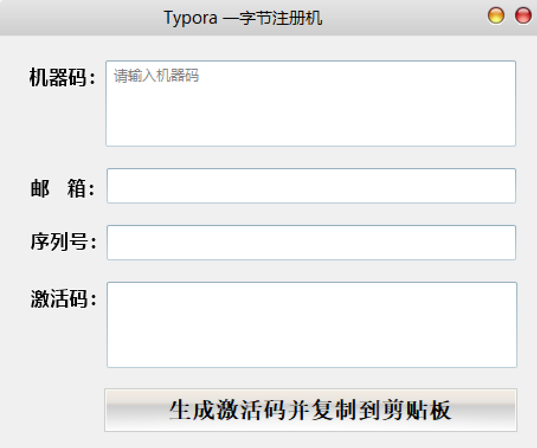

> 本文根据[Typora 1.10.8公钥替换](/article/p4u3p08j/)原理制作补丁

### 一、添加HOST

将下面两行添加到C:\Windows\System32\drivers\etc\hosts

```
127.0.0.1 dian.typora.com.cn
127.0.0.1 store.typora.io
```

### 二、安装补丁

下载[DWrite.dll](/DWrite.dll)，放在Typora安装目录下

### 三、注册

下载[注册机](/KeyGen_Typora.exe)



打开Typora，使用离线激活，复制机器码到注册机，邮箱和序列号可根据喜好填写，生成注册码并复制到软件中即可


