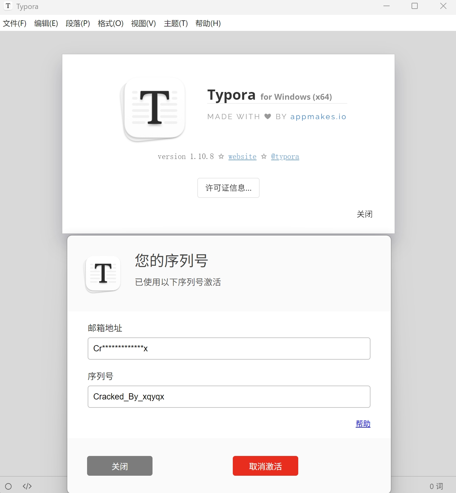

> 本文根据[Typora 1.10.8公钥替换](/article/p4u3p08j/)原理制作补丁

补丁理论上支持自2022年2月以来所有Typora版本

补丁会自动更新，如果因Typora版本更新导致补丁失效，可以尝试重新在这里下载

若重新下载仍失效，请告知我

### 一、安装补丁

下载[DWrite.dll](https://typora.xqyqx.cn/DWrite.dll)，放在Typora安装目录下

### 二、注册

注册机（这里用的iframe，自动复制功能可能会报错，请手动复制激活码）：

<iframe height='1000' width=100% src='https://typora.xqyqx.cn/'></iframe>

打开Typora，使用离线激活，复制机器码到注册机，邮箱和序列号可根据喜好填写，生成注册码并复制到软件中即可

<iframe height='420' width=100% src='https://xqy2006.github.io/dist-pages/license.html?dayRemains=15&index=0&hasActivated=true&email=This_is_my_Email&license=This_is_my_License_Code&lang=zh-Hans&needLicense=false&type=1&os=win'></iframe>
