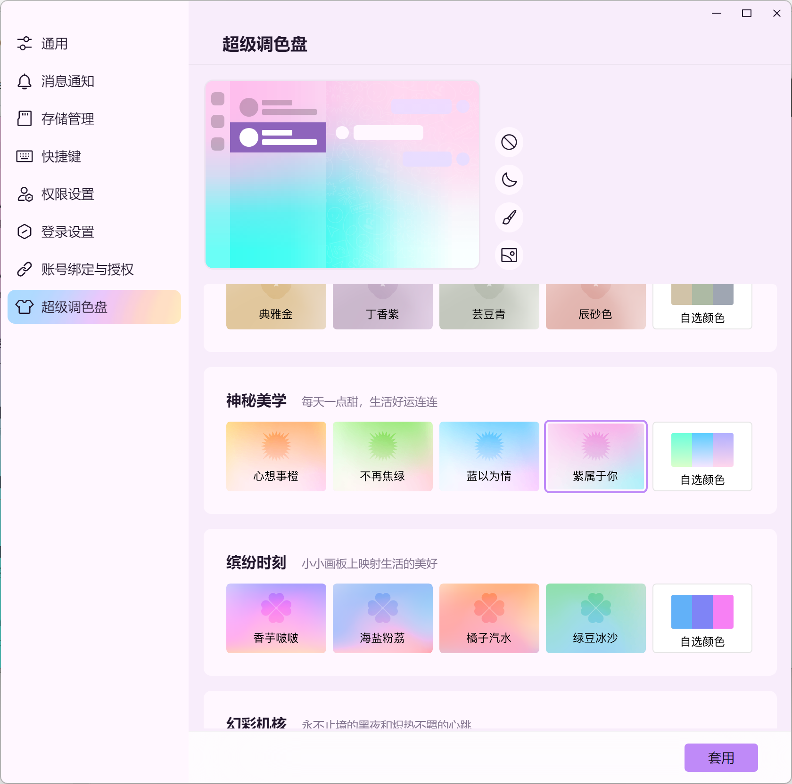
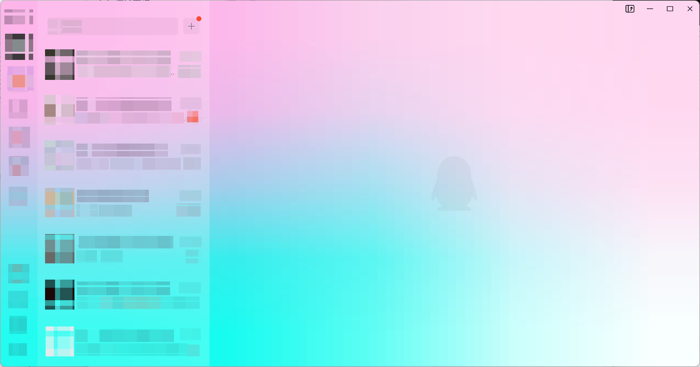

> 本文基于版本9.9.21-38711

## 获取前端伪代码

为支持多平台，软件采用的是electron架构，通过将js编译为jsc以保护前端代码，目前对改软件的修改多通过注入js，劫持IPC实现，但是极其容易被检测，从而触发风控，若是直接修改其前端的jsc字节码，则几乎不会被发现（目前没发现校验）


jsc可以从major.node中提取出来，之后再通过我之前的项目[jsc2js](https://github.com/xqy2006/jsc2js/)，可以将所有jsc转换为可读的js：[qqnt.js](/qqnt.js)

此外我还统计了其中出现中文的代码行：[utf8_strings.txt](/utf8_strings.txt)


有了前端的伪代码，我们该如何去实际修改呢？接下来以破解svip功能超级调色盘为例进行探究

## 破解超级调色盘

### 定位目标文件

软件的前端代码被拆分成数百个 webpack chunk（`.jsc` 文件），每个 chunk 用数字 ID 标识。第一步是从 633 个反编译 JS 文件中找出哪些与超级调色盘功能相关。

#### 搜索入口：中文关键词

最直接的入口是搜索功能名称本身：

```bash
grep -n "超级调色盘" qqnt.js
```

结果：

| 行号    | 文件     | 代码                                     | 含义                                  |
| ------- | -------- | ---------------------------------------- | ------------------------------------- |
| 617750  | 36346.js | `"超级调色盘" === a0["innerText"]`       | 新手引导：通过 DOM 元素文本匹配菜单项 |
| 617946  | 36346.js | `"打开超级调色盘，<br>定制你的QQ主题！"` | 引导气泡提示文案                      |
| 2264353 | 89454.js | `"超级调色盘" === a0[<unknown>]`         | 过滤侧边栏菜单，打开超级调色盘窗口    |

**36346.js** 是新手引导系统，仅负责展示 UI 引导动画，不涉及主题逻辑——**排除**。

**89454.js** 才是核心入口。

#### 分析 89454.js —— 超级调色盘入口组件

读取 89454.js 的 `onCall` 函数：

```javascript
function onCall() {
    // 在侧边栏菜单中查找"超级调色盘"项
    r3 = filter(item => "超级调色盘" === item[name])
    r0 = firstMatch  // 获取对应的 tabConfig
    // 打开设置窗口，传入 tabConfig
    openExternalWindow(SettingWindow, { tabConfig: r0 })
}
```

这揭示了架构：点击"超级调色盘"菜单 → 打开**设置窗口**（SettingWindow）并跳转到对应标签页。也就是说，超级调色盘的主 UI 不在 89454.js 本身，而在设置窗口加载的另一个 chunk 中。

89454.js 同时也包含 `selectTemplateTheme` 和 `selectStaticTheme` 函数（qqnt.js 第 2264415、2264462 行），它们处理主题选择时的 SVIP/试用/保存逻辑。但这是弹窗式的快捷入口（侧边栏面板），不是设置页的完整 UI。

#### 追踪 SVIP 按钮 —— 定位 77263.js

超级调色盘设置页面有三种按钮：SVIP 开通按钮、试用按钮、套用按钮。搜索这些 UI 控制函数：

```bash
grep -n "showSvipBtn\|showTrialBtn\|showFreeThemeUseBtn" qqnt.js
```

结果：**仅在 77263.js 中找到**：

```javascript
function get showSvipBtn() {
    return !isSelectedFreeTheme && !isSvip && !showTemplateTrialBtn && !isTrialing
}

function get showTrialBtn() {
    return !isSelectedFreeTheme && !isSvip && showTemplateTrialBtn && !isTrialing
}

function get showFreeThemeUseBtn() {
    return !isSvip && appearanceStore.isSelectedFreeTheme
}
```

进一步确认——搜索"套用"按钮文本：

```bash
grep -n "套用" qqnt.js
```

唯一匹配在 77263.js：

```javascript
r0[0] = Scope[216][2]["Uk"]("套用")
```

**结论**：`77263.jsc` 是超级调色盘设置页面的 Vue 组件，控制所有按钮的显隐和点击行为。

#### 追踪持久化逻辑 —— 定位 52574.js

在 77263.js 的 `handleClick` 函数中，点击"套用"按钮后执行：

```javascript
function handleClick() {
    if (this.appearanceStore.isSelectedFreeTheme) {
        this.trialThemeStore.cancelTrialTheme()
        this.appearanceStore.setThemeInfo()     // ← 关键：持久化保存
    }
}
```

`setThemeInfo()` 是主题持久化的核心方法。它来自 `appearanceStore`，而 `appearanceStore` 是通过 Pinia store 注入的。查看 77263.js 的模块初始化：

```javascript
Scope[5][9] = a2(52574)   // 导入 52574 模块
```

`get appearanceStore` getter：

```javascript
function get appearanceStore() {
    return Scope[5][11]["useStore"](Scope[5][9]["ZL"])  // 从 52574 创建 store
}
```

由此确认 `52574` 就是 AppearanceStore 所在的模块。搜索验证：

```bash
grep -n "func_setThemeInfo" qqnt.js
```

在 52574.js 中找到：

```javascript
function setThemeInfo(a0) {
    // ...日志：输出 isSvip、isDefaultThemeId、isFreeTheme 状态...
    if (!this.isSvip) {
        if (this.themeId !== defaultThemeId) {
            if (!this.isSelectedFreeTheme) {
                return undefined  // ← 三级拦截：非 SVIP + 非默认 + 非免费 → 拒绝
            }
        }
    }
    // 构建请求，调用 nodeIKernelSkinService.setThemeInfo() 持久化
}
```

**结论**：`52574.jsc` 是 AppearanceStore，包含 `setThemeInfo` 的权限校验逻辑。

#### 文件关系图

```
用户点击侧边栏"超级调色盘"
    │
    ▼
89454.jsc (onCall)
    │  过滤菜单项，调用 openExternalWindow(SettingWindow)
    │
    ▼
77263.jsc (设置页面 Vue 组件)                    ← 补丁 B1、B3、B11
    │  showSvipBtn / showTrialBtn / showFreeThemeUseBtn → 按钮显隐
    │  handleClick → 点击"套用"按钮
    │       │
    │       ▼  this.appearanceStore.setThemeInfo()
    │
    ▼
52574.jsc (AppearanceStore)                      ← 补丁 C1
    │  setThemeInfo() → 三级权限校验 → nodeIKernelSkinService.setThemeInfo()
    │
    ▼
持久化到本地配置
```

---

### V8 字节码基础

**以下的字节码仅针对当前软件版本所对应的V8版本，字节码会随着V8版本的不同而不同**

#### 关键操作码

| 操作码        | 助记符                    | 说明                                           |
| ------------- | ------------------------- | ---------------------------------------------- |
| `0E`          | LdaUndefined              | 累加器 = undefined（可用作 NOP 填充）          |
| `11`          | LdaTrue                   | 累加器 = true                                  |
| `12`          | LdaFalse                  | 累加器 = false                                 |
| `33 RR II FF` | GetNamedProperty          | 从寄存器 RR 读取属性，II=常量池索引，FF=反馈槽 |
| `5B`          | ToBooleanLogicalNot       | 累加器 = !累加器                               |
| `64`          | CallProperty0             | 无参方法调用                                   |
| `93 XX`       | Jump [XX]                 | 无条件跳转，目标 = 当前偏移 + XX               |
| `A0 XX`       | JumpIfToBooleanTrue [XX]  | 若累加器为 true 则跳转                         |
| `A1 XX`       | JumpIfToBooleanFalse [XX] | 若累加器为 false 则跳转                        |
| `A3 XX`       | JumpIfFalse [XX]          | 若累加器为 false 则跳转（不做 ToBoolean）      |
| `B3`          | Return                    | 返回累加器中的值                               |
| `CE`          | Star0                     | r0 = 累加器                                    |
| `CD`          | Star1                     | r1 = 累加器                                    |

#### BytecodeArray 二进制布局

在 `.jsc` 文件中，每个函数的字节码前有 39 字节的 BytecodeArray 头部。其中**紧邻字节码的 13 字节**格式为：

```
XX FF 00 00 00 PP 00 00 00 00 00 00 00
```

- `XX` — 函数相关的标记字节（不同函数不同，如 `67`、`6a` 等）
- `FF` — frame_size（寄存器数 × 8）
- `PP` — parameter_count（含 this）

这 13 字节可作为搜索时的唯一性前缀。若仍有重复，可继续向前扩展（BytecodeArray 头部共 39 字节），直至特征码唯一。

#### 寄存器编码

| 编码 | 含义     |
| ---- | -------- |
| `02` | `<this>` |
| `F9` | `r0`     |
| `F8` | `r1`     |
| `F7` | `r2`     |
| ...  | 依次递减 |

---

### 定位目标函数

#### 从 UI 行为出发

我们需要让付费主题出现"套用"按钮，点击后永久保存。

在反编译的 `77263.js` 中搜索关键词：

```
grep -n "showSvipBtn\|showTrialBtn\|showFreeThemeUseBtn\|setThemeInfo\|isSvip" 77263.js
```

发现关键 computed 属性和方法：

| 函数名                           | 行号 | 作用                   |
| -------------------------------- | ---- | ---------------------- |
| `showSvipBtn`                    | 4503 | 控制"开通SVIP"按钮显隐 |
| `showTrialBtn`                   | 4519 | 控制"试用"按钮显隐     |
| `showFreeThemeUseBtn`            | 4535 | 控制"套用"按钮显隐     |
| `handleClick`（FreeThemeUseBtn） | 4208 | "套用"按钮点击处理     |

#### 分析按钮显隐逻辑

从反编译 JS 中读到的逻辑：

**showSvipBtn**（显示"开通SVIP"按钮）：

```javascript
return !isSelectedFreeTheme && !isSvip && !showTemplateTrialBtn && !isTrialing
```

**showTrialBtn**（显示"试用"按钮）：

```javascript
return !isSelectedFreeTheme && !isSvip && showTemplateTrialBtn && !isTrialing
```

**showFreeThemeUseBtn**（显示"套用"按钮）：

```javascript
return !isSvip && this.appearanceStore.isSelectedFreeTheme
```

→ 仅对免费主题显示"套用"。

**handleClick**（FreeThemeUseBtn 的点击事件）：

```javascript
if (this.appearanceStore.isSelectedFreeTheme) {  // 仅免费主题可执行
    this.trialThemeStore.cancelTrialTheme()       // 取消试用
    this.appearanceStore.setThemeInfo()            // 保存主题（持久化）
}
```

#### 分析 setThemeInfo 的权限校验

在 `52574.js` 中找到 `setThemeInfo` 的实现：

```javascript
async setThemeInfo(a0) {
    // ...日志...
    if (!this.isSvip) {                           // 非 SVIP
        if (this.themeId !== defaultThemeId) {     // 非默认主题
            if (!this.isSelectedFreeTheme) {       // 非免费主题
                return undefined;                  // ← 直接拒绝！
            }
        }
    }
    // 通过校验后，构建请求并保存
    nodeIKernelSkinService.setThemeInfo(request)
}
```

**结论**：`setThemeInfo` 内部有三级拦截，非 SVIP 用户保存付费主题会被静默拒绝。

---

### 从 JS 映射到字节码

#### 在字节码转储中定位函数

字节码转储文件 `77263.txt` 包含每个函数的 `SharedFunctionInfo` 及完整字节码。通过函数名搜索定位：

```
grep -n "showSvipBtn\|showFreeThemeUseBtn" 77263.txt
```

找到：

```
33837: 00000326001A9AF5: [SharedFunctionInfo] get showSvipBtn
33978: 00000326001A9C15: [SharedFunctionInfo] get showFreeThemeUseBtn
31607: 00000326001A82D5: [SharedFunctionInfo] handleClick
```

#### 读取字节码

**showSvipBtn**（BytecodeArray[32]）：

```
offset  0: 33 02 00 00    GetNamedProperty <this>, [0]  ; appearanceStore
offset  4: CE             Star0
offset  5: 33 F9 01 02    GetNamedProperty r0, [1]      ; isSelectedFreeTheme
offset  9: 5B             ToBooleanLogicalNot
offset 10: A3 15          JumpIfFalse [21] → 31          ; if isSelectedFreeTheme → 跳到 return
offset 12: 33 02 02 04    GetNamedProperty <this>, [2]  ; isSvip
offset 16: 5B             ToBooleanLogicalNot
offset 17: A3 0E          JumpIfFalse [14] → 31
offset 19: 33 02 03 06    GetNamedProperty <this>, [3]  ; showTemplateTrialBtn
offset 23: 5B             ToBooleanLogicalNot
offset 24: A3 07          JumpIfFalse [7] → 31
offset 26: 33 02 04 08    GetNamedProperty <this>, [4]  ; isTrialing
offset 30: 5B             ToBooleanLogicalNot
offset 31: B3             Return
```

注意跳转距离：`A3 15`（→31）、`A3 0E`（→31）、`A3 07`（→31），都跳转到同一个 return。

**showFreeThemeUseBtn**（BytecodeArray[17]）：

```
offset  0: 33 02 00 00    GetNamedProperty <this>, [0]  ; isSvip
offset  4: 5B             ToBooleanLogicalNot
offset  5: A3 0B          JumpIfFalse [11] → 16          ; if isSvip → return(false)
offset  7: 33 02 01 02    GetNamedProperty <this>, [1]  ; appearanceStore
offset 11: CE             Star0
offset 12: 33 F9 02 04    GetNamedProperty r0, [2]      ; isSelectedFreeTheme
offset 16: B3             Return                          ; return isSelectedFreeTheme
```

**handleClick**（FreeThemeUseBtn，BytecodeArray[41]）：

```
offset  0: 33 02 00 00    GetNamedProperty <this>, [0]  ; appearanceStore
offset  4: CE             Star0
offset  5: 33 F9 01 02    GetNamedProperty r0, [1]      ; isSelectedFreeTheme
offset  9: A1 1E          JumpIfToBooleanFalse [30] → 39 ; 非免费主题 → 跳过
offset 11: 33 02 02 04    GetNamedProperty <this>, [2]  ; trialThemeStore
offset 15: CD             Star1
offset 16: 33 F8 03 06    GetNamedProperty r1, [3]      ; cancelTrialTheme
offset 20: CE             Star0
offset 21: 64 F9 F8 08    CallProperty0                  ; cancelTrialTheme()
offset 25: 33 02 00 0A    GetNamedProperty <this>, [0]  ; appearanceStore
offset 29: CD             Star1
offset 30: 33 F8 04 0C    GetNamedProperty r1, [4]      ; setThemeInfo
offset 34: CE             Star0
offset 35: 64 F9 F8 0E    CallProperty0                  ; setThemeInfo()
offset 39: 0E             LdaUndefined
offset 40: B3             Return
```

常量池：`[0]=appearanceStore, [1]=isSelectedFreeTheme, [2]=trialThemeStore, [3]=cancelTrialTheme, [4]=setThemeInfo`

**setThemeInfo 权限校验**（52574.txt，BytecodeArray[410]）：

```
offset  99: 33 02 04 10    GetNamedProperty <this>, [4]  ; isSvip
offset 103: A0 23          JumpIfToBooleanTrue [35] → 138 ; SVIP → 跳过校验
offset 105: 33 02 06 12    GetNamedProperty <this>, [6]  ; themeId
offset 109: C9             Star5
offset 110: 19 13          LdaImmutableCurrentContextSlot [19] ; defaultThemeId
offset 112: C8             Star6
offset 113: 33 F3 07 09    GetNamedProperty r6, [7]
offset 117: 74 F4 14       TestEqualStrict r5             ; themeId === default?
offset 120: A2 12          JumpIfTrue [18] → 138           ; 是默认主题 → 放行
offset 122: 33 02 09 15    GetNamedProperty <this>, [9]  ; isSelectedFreeTheme
offset 126: A0 0C          JumpIfToBooleanTrue [12] → 138 ; 免费主题 → 放行
offset 128: 0E             LdaUndefined                    ; ← 拒绝保存
offset 129-137: ... return undefined
offset 138: 85 0A 17 29    CreateObjectLiteral             ; ← 开始构建保存请求
```

---

### 构造补丁

| 文件      | 目标函数            | 策略                                             |
| --------- | ------------------- | ------------------------------------------------ |
| 77263.jsc | showSvipBtn         | 返回 false → 隐藏"开通SVIP"按钮                  |
| 77263.jsc | showFreeThemeUseBtn | 返回 true → 所有主题显示"套用"                   |
| 77263.jsc | handleClick         | 去掉 isSelectedFreeTheme 条件 → 付费主题也能套用 |
| 52574.jsc | setThemeInfo        | 跳过三级权限校验 → 允许保存付费主题              |

**替换整个函数体为常量返回：**

原理：将函数体首字节改为 `11 B3`（LdaTrue + Return）或 `12 B3`（LdaFalse + Return），后续字节用 `0E`（LdaUndefined）填充。V8 解释器执行到 Return 后即返回，填充字节永远不会被执行。

```
原始: 33 02 00 00 CE 33 F9 01 02 5B A3 15 ...  (复杂的条件逻辑)
修改: 12 B3 0E 0E 0E 0E 0E 0E 0E 0E 0E 0E ...  (直接返回 false)
```

**去除条件跳转：**

原理：将 `A1 1E`（JumpIfToBooleanFalse [30]）替换为 `0E 0E`（两个 NOP），使代码无条件执行后续的 `cancelTrialTheme()` + `setThemeInfo()`。

```
原始 offset 9: A1 1E  → 若 isSelectedFreeTheme 为 false，跳过保存
修改 offset 9: 0E 0E  → 无条件落入保存逻辑
```

**条件跳转改为无条件跳转：**

原理：将 `A0 23`（JumpIfToBooleanTrue [35]）改为 `93 23`（Jump [35]），无论 isSvip 是否为 true，都无条件跳转到 offset 138 开始保存。原来只有 SVIP 用户能到达的保存代码，现在所有用户都能执行。

```
原始 offset 103: A0 23  → 仅 isSvip 为 true 时跳到保存
修改 offset 103: 93 23  → 无条件跳到保存
```

---

### 完整补丁列表

#### 77263.jsc— showSvipBtn → return false

**搜索**（32字节）：

```
33 02 00 00 CE 33 F9 01 02 5B A3 15 33 02 02 04 5B A3 0E 33 02 03 06 5B A3 07 33 02 04 08 5B B3
```

**替换**（32字节）：

```
12 B3 0E 0E 0E 0E 0E 0E 0E 0E 0E 0E 0E 0E 0E 0E 0E 0E 0E 0E 0E 0E 0E 0E 0E 0E 0E 0E 0E 0E 0E 0E
```

#### 77263.jsc— showFreeThemeUseBtn → return true

**搜索**（37字节）：

```
11 04 75 05 04 0D 2E 67 08 00 00 00 01 00 00 00 00 00 00 00 33 02 00 00 5B A3 0B 33 02 01 02 CE 33 F9 02 04 B3
```

**替换**（37字节）：

```
11 04 75 05 04 0D 2E 67 08 00 00 00 01 00 00 00 00 00 00 00 11 B3 0E 0E 0E 0E 0E 0E 0E 0E 0E 0E 0E 0E 0E 0E 0E
```

#### 77263.jsc— handleClick 去除 isSelectedFreeTheme 守卫

**搜索**（41字节）：

```
33 02 00 00 CE 33 F9 01 02 A1 1E 33 02 02 04 CD 33 F8 03 06 CE 64 F9 F8 08 33 02 00 0A CD 33 F8 04 0C CE 64 F9 F8 0E 0E B3
```

**替换**（41字节）：

```
33 02 00 00 CE 33 F9 01 02 0E 0E 33 02 02 04 CD 33 F8 03 06 CE 64 F9 F8 08 33 02 00 0A CD 33 F8 04 0C CE 64 F9 F8 0E 0E B3
```

#### 52574.jsc— setThemeInfo 跳过权限检查

**搜索**（15字节）：

```
65 F4 F3 F2 0E 33 02 04 10 A0 23 33 02 06 12
```

**替换**（15字节）：

```
65 F4 F3 F2 0E 33 02 04 10 93 23 33 02 06 12
```





