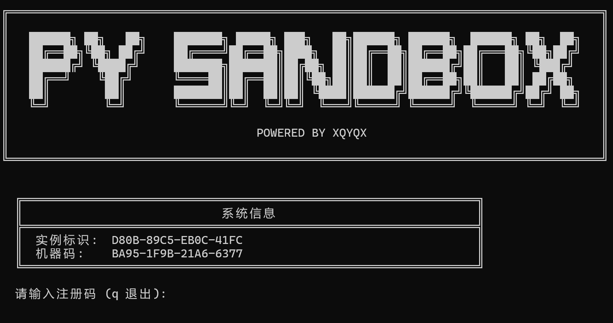

静态编译后的Python本身就是一个十分复杂的系统，且难以恢复符号，十分适合用来当壳，在AI的帮助下花一天搓了个简单的授权系统，可以通过process hollowing加载任意32/64位EXE程序

然后又用C#写了一个加壳器

经测试在体积较小的exe（10MB以下）均能良好运行

但在较大的exe（例如electron打包的应用）会导致闪退（暂未找到原因），并且十分缓慢（Python的运行速度相较于其它语言还是太慢了）

下载地址：

[https://wwbdu.lanzouv.com/iPYWm3h00pmd](https://wwbdu.lanzouv.com/iPYWm3h00pmd)
