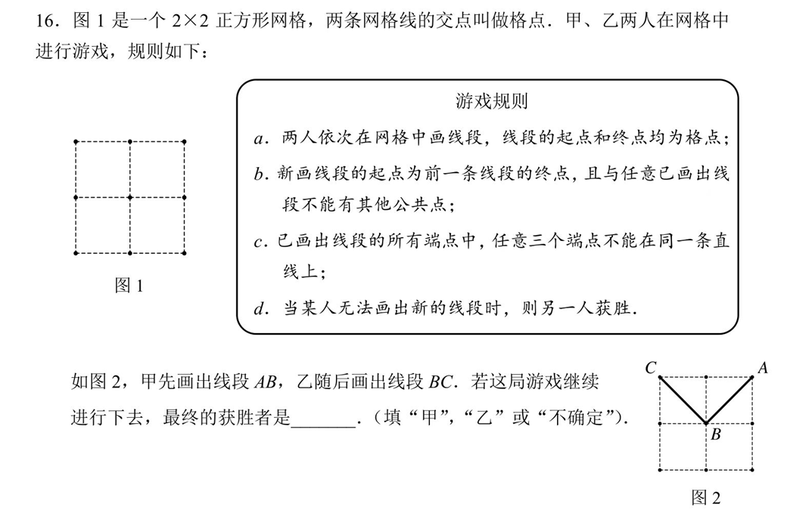
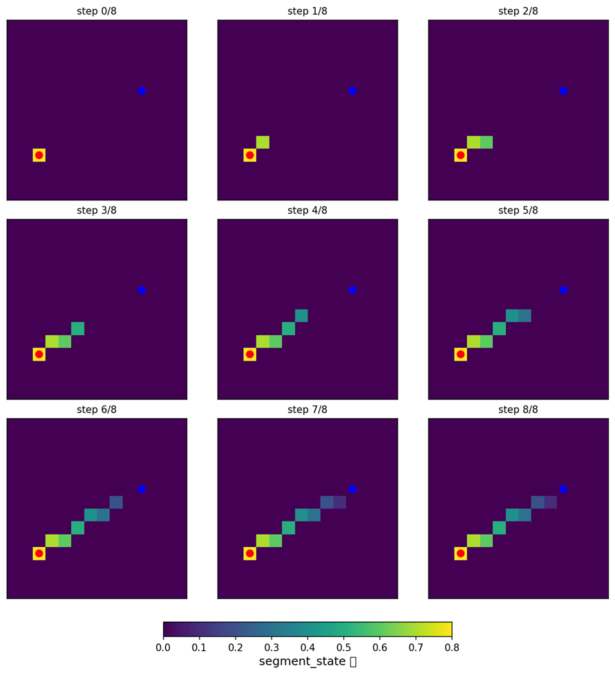
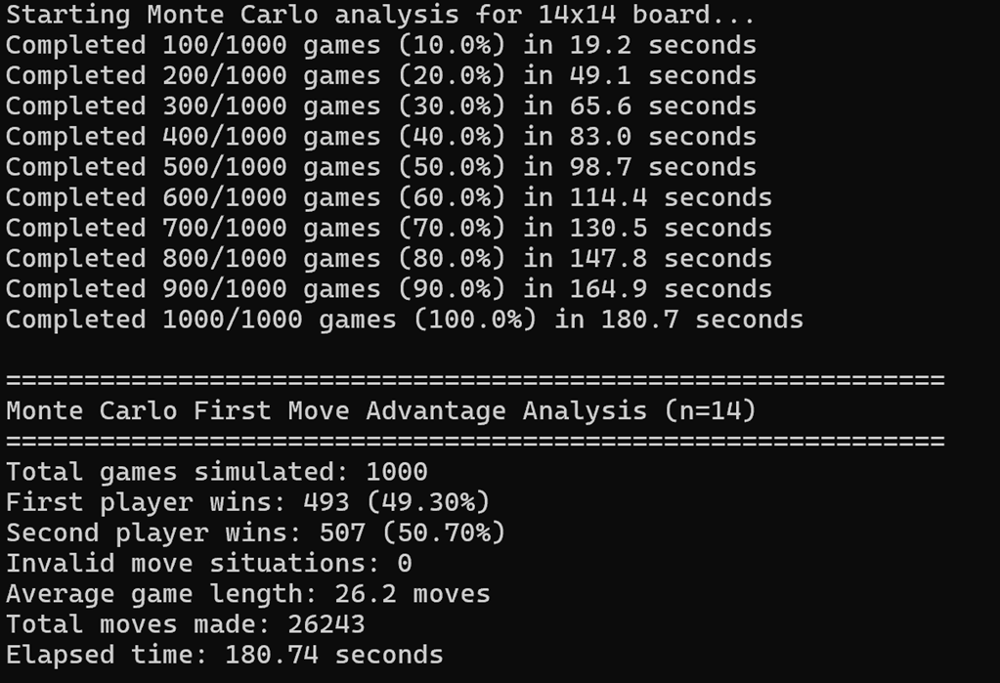
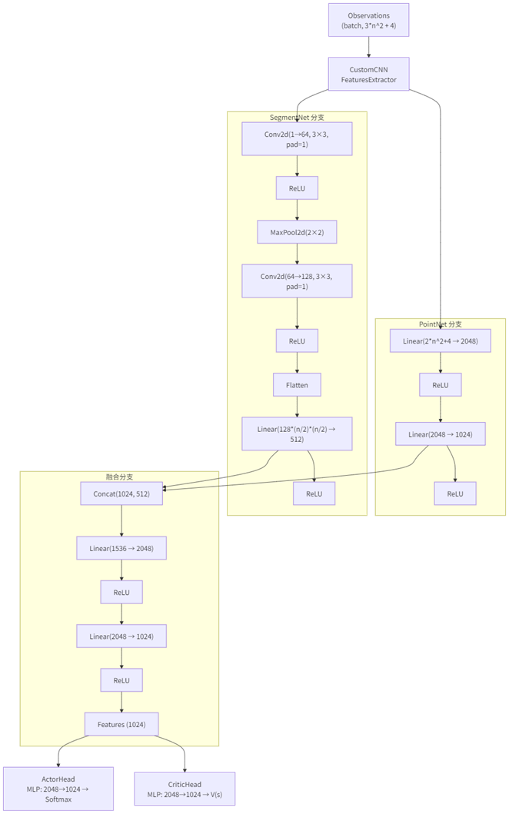
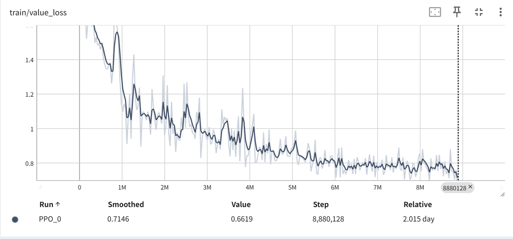
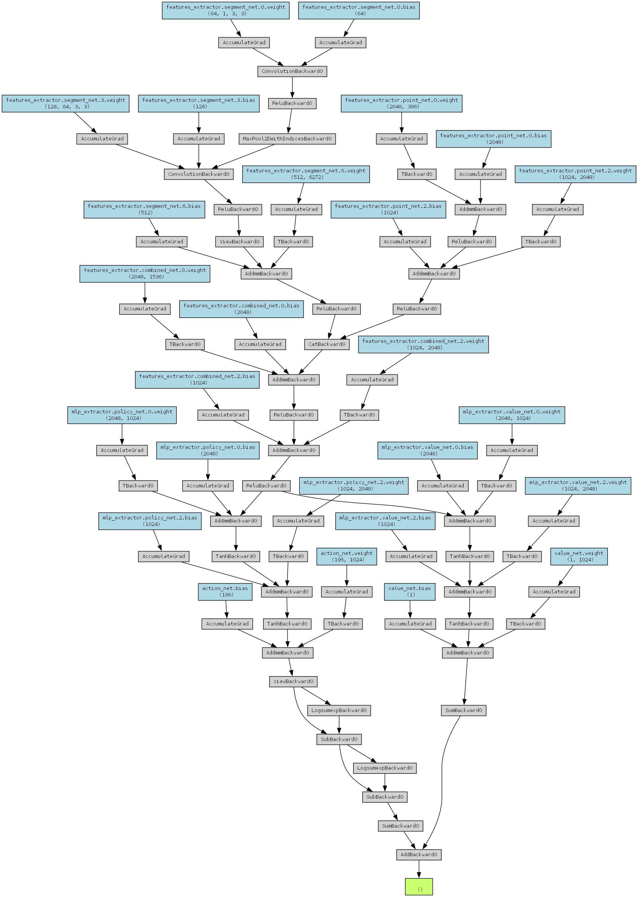
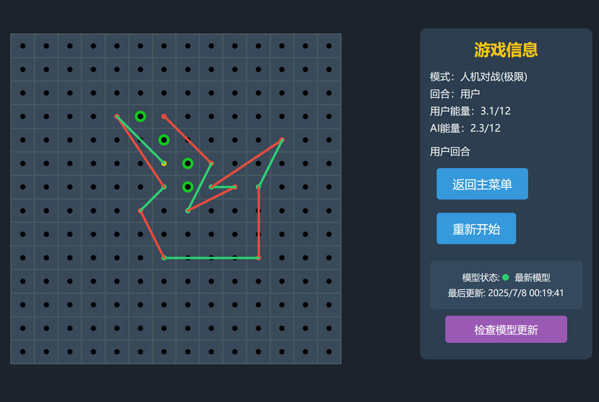

### 规则设计

游戏灵感来源于一道中考模拟题：


这里说是2×2的正方形网格实际上可以看出3×3的点阵，共9个点可选（下文中所有的n都是对于点阵而非网格）


根据这道题目我重新设计了规则：

- 棋盘为14×14格点

- 两人依次在网格中画线段，线段的起点和终点均为格点

- 新画线段的起点为前一条线段的终点，且与任意已画出线段不能有其他公共点

- 当某人无法画出新的线段时，则另一人获胜
- **能量限制：移动距离不能超过当前能量值**


为什么是14×14呢？首先相较于原题的3×3，我们显然需要增加棋盘大小以增强策略性，其次我们引入了新的规则：能量限制，这样是为了防止玩家画出超长线段直接分割棋盘，那么再大的棋盘也就没有意义了，我们没必要设置太大的棋盘，我们只需要控制每回合回复的能量的大小即可控制一局游戏的平均步数，鉴于我们需要使游戏能够在小屏幕（手机）上显示，太大的棋盘不方便操作，最后选定了n=14


为了防止囤积能量然后仍然分割棋盘，因此应当鼓励花费能量，这里我们可以增加一个每回合能量衰减的机制，最终设计的能量计算公式为：
$$
E_{turn}=3+0.8E_{turn-1}
$$

### 规则实现

那么接下来，我们可以着手将游戏规则实现出来，因为我们需要训练强化学习模型，因此我们可以先编写一个gym环境，然后暴露接口给模型进行训练，这里我们先构建一个符合当前游戏规则的gym环境：


现在，我们需要思考给模型需要暴露一些什么信息，设置什么奖励提供给模型

首先我们可以将游戏分为3个阶段：

- Phase 0：先手玩家选择起点
- Phase 1：先手玩家选择终点
- Phase 2：对弈

> 其实这里Phase 1可以和Phase 2可以合并的，但是已经这么写了就先懒得改了

我选择向模型暴露这些信息：

- 已用点&当前点

- 双方能量 E₀、E₁

- 游戏阶段

- 回合数

- 线段状态

#### 线段状态压缩

如果直接使用一个n\^2\*n\^2的掩码矩阵来记录线段状态的话，将会产生非常大的维度，因此我们需要将信息进行压缩，这里我将棋盘上的线段进行采样渲染，最后整个棋盘形成一张图，这十分有利于CNN学习图像特征，采样过程中我设置了衰减，以体现能量衰减和游戏进程，下面是一个示意图：



### 奖励设置

我们引入一个概念：一击必胜

由于这个游戏一定会存在制胜的最后一步和导致失败的倒数第二步，因此我们对一击制胜的最后一步设置一个很大的奖励，将导致失败的倒数第二步设置惩罚（此外还可以继续往前追溯倒数第三步第四步进行奖励和惩罚，但是碍于训练模型时的CPU的性能瓶颈，因此目前并没有设置）

此外，当当前步使得对手可活动空间减少时，我们也基于一个小奖励

不暴露漏洞，找到对方的漏洞是这个游戏获胜的关键，因此我们不需要太多其它的奖励指标，最终的奖励设置如下：

| **奖励类型** | **计算方式**    | **目的**     |
| ------------ | --------------- | ------------ |
| 空间压制     | 1 -  对手自由度 | 限制对手移动 |
| 漏洞惩罚     | -3.0            | 避免危险走法 |
| 制胜奖励     | +3.0            | 鼓励终结游戏 |

基于上文所述，我们可以编写完整的`game_env.py`：

```python
import gymnasium as gym
import math, random
import numpy as np
from gymnasium import spaces
import collections

class NoCrossLinesEnv(gym.Env):
    metadata = {'render_modes': ['human'], 'render_fps': 4}  # 更新 metadata
    
    def __init__(self, n=14, m=3, alpha=0.8, Emax=12):
        
        super().__init__()
        self.n, self.m, self.alpha, self.Emax = n, m, alpha, Emax
        self.action_space = spaces.Discrete(n*n)
        self.segment_state = None
        
        low = np.zeros(n*n*2 + n*n + 4, dtype=np.float32)  # 新增n*n维度
        high = np.ones_like(low, dtype=np.float32)
        self.observation_space = spaces.Box(low, high, dtype=np.float32)
        self.seed()
    
    def seed(self, seed=None):
        self.np_random, seed = gym.utils.seeding.np_random(seed)
        return [seed]
    
    def reset(self, seed=None, options=None):
        # 初始化随机种子
        if seed is not None:
            self.seed(seed)
        
        self.used   = np.zeros(self.n*self.n, dtype=bool)
        self.segs   = []             # list of (a,b)
        self.cur    = None
        self.E      = [0.0, 0.0]
        self.turn   = 0
        self.phase  = 0              # 0=选起点,1=首步,2=对弈中
        self.over   = False
        self.winner = None
        # 初始化线段状态矩阵（n x n）
        self.segment_state = np.zeros((self.n, self.n), dtype=np.float32)
        self.cur_players = [None, None]
        return self._get_obs(), {}  # 返回观察和空字典
    def _update_segment_state(self, a, b):
        """更新线段状态矩阵"""
        xa, ya = self.xy(a)
        xb, yb = self.xy(b)
        
        # 计算线段方向向量
        dx = xb - xa
        dy = yb - ya
        
        # 计算线段长度
        length = max(abs(dx), abs(dy))
        if length == 0:
            return
            
        # 沿线段路径更新状态
        for i in range(length + 1):
            t = i / length
            x = int(round(xa + t * dx))
            y = int(round(ya + t * dy))
            if 0 <= x < self.n and 0 <= y < self.n:
                # 使用线性衰减值表示线段影响
                self.segment_state[y, x] = min(1.0, self.segment_state[y, x] + 0.8 * (1 - t))

    def _get_obs(self):
        u = self.used.astype(np.float32)
        c = np.zeros_like(u)
        if self.cur is not None:
            c[self.cur] = 1.0
        
        # 展平线段状态矩阵并归一化
        seg_flat = self.segment_state.flatten().astype(np.float32)
        
        e0, e1 = self.E[0]/self.Emax, self.E[1]/self.Emax
        p2 = self.phase / 2.0
        t0 = float(self.turn)
        
        # 包含线段状态
        return np.concatenate([u, c, seg_flat, [e0, e1, p2, t0]]).astype(np.float32)

    
    # —— 平面几何 ——  
    def xy(self, i):
        # 返回 (x, y)：x=col, y=row
        return (i % self.n, i // self.n)

    def orient(self, a, b, c):
        xa, ya = self.xy(a); xb, yb = self.xy(b); xc, yc = self.xy(c)
        return (xb - xa)*(yc - ya) - (yb - ya)*(xc - xa)

    def on_segment(self, a, b, c):
        # c 在线段 ab 上（包括端点）
        if self.orient(a, b, c) != 0:
            return False
        xa, ya = self.xy(a); xb, yb = self.xy(b); xc, yc = self.xy(c)
        return (min(xa, xb) <= xc <= max(xa, xb)
                and min(ya, yb) <= yc <= max(ya, yb))

    def segments_intersect(self, a, b, c, d):
        o1 = self.orient(a, b, c)
        o2 = self.orient(a, b, d)
        o3 = self.orient(c, d, a)
        o4 = self.orient(c, d, b)
        if o1*o2 < 0 and o3*o4 < 0:
            return True
        # 端点共线或在对方线上
        if self.on_segment(a, b, c): return True
        if self.on_segment(a, b, d): return True
        if self.on_segment(c, d, a): return True
        if self.on_segment(c, d, b): return True
        return False
    
    # —— 合法走法计算 ——  
    def _legal_moves(self):
        if self.over:
            return []
        # phase 0: 选任意起点
        if self.phase == 0:
            return list(range(self.n*self.n))
        # phase 1: 首步，用 P0 当前能量
        if self.phase == 1:
            ret = []
            for p in range(self.n*self.n):
                if p == self.cur: continue
                d = self.dist(self.cur, p)
                if d <= self.E[0] + 1e-9:
                    ret.append((p, d))
            return ret
        # phase 2: 对弈中，用当前 turn 能量，且不在线段上、不相交
        ret = []
        for p in range(self.n*self.n):
            if p == self.cur or self.used[p]:
                continue
            # 跳过任何在线段上的点（包括内部）
            if any(self.on_segment(a, b, p) for a,b in self.segs):
                continue
            d = self.dist(self.cur, p)
            if d > self.E[self.turn] + 1e-9:
                continue
            # 检查不与已画段相交（允许首尾相连）
            ok = True
            for a,b in self.segs:
                if b == self.cur:
                    continue
                if self.segments_intersect(self.cur, p, a, b):
                    ok = False
                    break
            if ok:
                ret.append((p, d))
        return ret

    def dist(self, i, j):
        xi, yi = self.xy(i); xj, yj = self.xy(j)
        return math.hypot(xi - xj, yi - yj)
    
    
    # 添加动作掩码方法
    def action_mask(self):
        """返回当前状态下合法动作的掩码"""
        mask = np.zeros(self.action_space.n, dtype=bool)
        legal_moves = self._legal_moves()
        
        if self.phase == 0:
            # 所有点都是合法的
            legal_points = legal_moves
        elif legal_moves and isinstance(legal_moves[0], tuple):
            # 提取点索引
            legal_points = [p for p, _ in legal_moves]
        else:
            legal_points = legal_moves
            
        mask[legal_points] = True
        return mask
    
    def _get_opponent_moves(self):
        """获取对手所有可能的合法移动"""
        if self.over:
            return []
        
        # 保存当前状态
        saved_state = self._save_state()
        
        # 切换到对手视角
        self.turn = 1 - self.turn
        self.cur = self.cur_players[self.turn]
        
        # 如果对手位置无效，则没有合法移动
        if self.cur is None:
            self._restore_state(saved_state)
            return []
        
        # 获取合法动作并处理不同返回类型
        lm = self._legal_moves()
        moves = []
        
        if lm:
            # 检查返回类型
            if isinstance(lm[0], tuple):
                # 元组类型 (p, d)
                moves = [p for p, _ in lm]
            else:
                # 整数类型 p
                moves = list(lm)
        
        # 恢复原始状态
        self._restore_state(saved_state)
        
        return moves


    
    def _get_opponent_paths(self):
        """获取对手所有潜在路径（考虑多步）"""
        opponent_pos = self.cur_players[1 - self.turn]
        if opponent_pos is None:
            return []
        
        paths = []
        # 获取对手位置
        x, y = self.xy(opponent_pos)
        
        # 检查8个方向的路径
        for dx, dy in [(0,1), (1,0), (0,-1), (-1,0), (1,1), (1,-1), (-1,1), (-1,-1)]:
            path = []
            for step in range(1, self.n):
                nx, ny = x + dx*step, y + dy*step
                if 0 <= nx < self.n and 0 <= ny < self.n:
                    point = ny * self.n + nx
                    # 检查点是否可用且未被阻塞
                    if not self.used[point] and self.segment_state[ny, nx] < 0.7:
                        path.append(point)
                    else:
                        break
            if path:
                paths.append([opponent_pos] + path)
        return paths

    
    def _save_state(self):
        """保存当前游戏状态"""
        return {
            'used': self.used.copy(),
            'segs': self.segs.copy(),
            'cur': self.cur,
            'E': self.E.copy(),
            'turn': self.turn,
            'phase': self.phase,
            'over': self.over,
            'winner': self.winner,
            'segment_state': self.segment_state.copy(),
            'cur_players': self.cur_players.copy()
        }
    
    def _restore_state(self, state):
        """恢复游戏状态"""
        self.used = state['used'].copy()
        self.segs = state['segs'].copy()
        self.cur = state['cur']
        self.E = state['E'].copy()
        self.turn = state['turn']
        self.phase = state['phase']
        self.over = state['over']
        self.winner = state['winner']
        self.segment_state = state['segment_state'].copy()
        self.cur_players = state['cur_players'].copy()
    
    def _apply_action(self, action):
        """模拟应用动作（不检查合法性）"""
        if self.phase == 0:
            self.cur = action
            self.used[action] = True
            self.phase = 1
            self.E[0] = self.m  # 添加能量初始化
        elif self.phase == 1:
            d = self.dist(self.cur, action)
            self.segs.append((self.cur, action))
            self._update_segment_state(self.cur, action)
            self.used[action] = True
            self.E[0] -= d  # 更新能量
            self.cur = action
            self.phase = 2
            self.turn = 1
            # 对手能量补充
            self.E[1] = min(self.Emax, self.alpha * self.E[1] + self.m)
        else:
            d = self.dist(self.cur, action)
            self.segs.append((self.cur, action))
            self._update_segment_state(self.cur, action)
            self.used[action] = True
            self.E[self.turn] -= d  # 更新当前玩家能量
            self.cur = action
            self.turn = 1 - self.turn  # 切换回合
            # 新回合玩家能量补充
            self.E[self.turn] = min(self.Emax, self.alpha * self.E[self.turn] + self.m)

    
    def _is_high_risk_position(self, player=None):
        """检查指定玩家位置是否高风险"""
        if player is None:
            player = 1 - self.turn  # 默认检查对手
        
        pos = self.cur_players[player]
        if pos is None: 
            return False
        # 简化实现：检查是否被三面包围
        if self.cur is None:
            return False
            
        x, y = self.xy(self.cur)
        blocked_sides = 0
        for dx, dy in [(0,1), (1,0), (0,-1), (-1,0)]:
            nx, ny = x + dx, y + dy
            if 0 <= nx < self.n and 0 <= ny < self.n:
                if self.segment_state[ny, nx] > 0.7 or self.used[ny * self.n + nx]:
                    blocked_sides += 1
        return blocked_sides >= 3

    
    def _calculate_opponent_freedom(self):
        # 获取对手所有可能移动路径
        opponent_moves = self._get_opponent_paths()
        
        # 计算每条路径的阻塞程度
        path_scores = []
        for path in opponent_moves:
            path_block = 0
            for i, point in enumerate(path):
                x, y = self.xy(point)
                weight = 1.0 - (i / len(path)) * 0.5  # 起点权重1.0，终点权重0.5
                path_block += self.segment_state[y, x] * weight

            path_scores.append(path_block / len(path))
        
        # 返回最畅通路径的分数（1表示完全自由）
        return 1 - min(path_scores) if path_scores else 0.0
    
    def _check_forcing_move_vulnerability(self, action):
        """检查执行当前动作是否会创造漏洞（添加日志）"""
        #print(f"===== 开始漏洞检测 =====")
        #print(f"当前玩家: P{self.turn}, 动作: {self.xy(action)}")
        #print(f"当前能量: P0={self.E[0]:.2f}, P1={self.E[1]:.2f}")
        
        # 保存状态
        saved_state = self._save_state()
        
        try:
            # 模拟执行当前动作
            #print(f"模拟执行动作: {self.xy(action)}")
            self._apply_action(action)
            
            # 获取对手可能的移动
            opponent_moves = self._get_opponent_moves()
            #print(f"对手可能的移动: {len(opponent_moves)}个")
            
            penalty = 0.0
            found_vulnerability = False
            
            # 检查每个对手移动是否会造成一击制胜
            for i, opponent_move in enumerate(opponent_moves):
                #print(f"检查对手动作 {i+1}/{len(opponent_moves)}: {self.xy(opponent_move)}")
                
                # 检查这个动作是否会造成一击制胜
                if self._would_be_forcing_move(opponent_move):
                    #print(f"  发现漏洞! 对手动作 {self.xy(opponent_move)} 可一击制胜")
                    penalty = -3.0
                    found_vulnerability = True
                    break
            
            if not found_vulnerability:
                #print("  未发现一击制胜漏洞")
                pass
            return penalty
        except Exception as e:
            #print(f"漏洞检测出错: {e}")
            return 0.0
        finally:
            # 恢复状态
            self._restore_state(saved_state)
            #print(f"恢复状态完成")
            #print(f"===== 结束漏洞检测 =====")


    
    def _is_forcing_move(self, action):
        """检查当前动作是否是一击制胜"""
        # 保存当前状态
        saved_state = self._save_state()
        
        # 模拟执行动作
        self._apply_action(action)
        
        # 检查对手是否有合法移动
        has_legal_moves = len(self._legal_moves()) > 0
        
        # 恢复状态
        self._restore_state(saved_state)
        
        return not has_legal_moves
    
    def _would_be_forcing_move(self, move):
        """检查指定动作是否会造成一击制胜"""
        # 保存当前状态
        saved_state = self._save_state()
        
        # 模拟执行动作
        self._apply_action(move)
        
        # 检查是否有合法移动
        has_legal_moves = len(self._legal_moves()) > 0
        
        # 恢复状态
        self._restore_state(saved_state)
        
        return not has_legal_moves
    
    def _calculate_control_ratio(self):
        """计算空间控制比例（基于可达区域）"""
        # 洪水填充计算控制区域
        player_area = self._flood_fill_area(self.cur_players[self.turn])
        opp_area = self._flood_fill_area(self.cur_players[1 - self.turn])
        
        total = player_area + opp_area
        return player_area / total if total > 0 else 0.5
    
    def _flood_fill_area(self, start_point):
        if start_point is None:
            return 0
        
        # 使用集合代替数组（更准确）
        visited = set()
        queue = collections.deque([start_point])
        area = 0
        
        while queue:
            point = queue.popleft()
            if point in visited:
                continue
                
            visited.add(point)
            area += 1
            
            x, y = self.xy(point)
            for dx, dy in [(0,1), (1,0), (0,-1), (-1,0)]:
                nx, ny = x + dx, y + dy
                if 0 <= nx < self.n and 0 <= ny < self.n:
                    neighbor = ny * self.n + nx
                    
                    # 检查是否可通行（考虑线段阻塞）
                    if not self.used[neighbor] and self.segment_state[ny, nx] < 0.7:
                        # 检查路径是否被阻塞
                        if not self._is_line_blocked(x, y, nx, ny):
                            queue.append(neighbor)
        
        return area

    def _is_line_blocked(self, x1, y1, x2, y2):
        """检查两点间直线路径是否被阻塞"""
        dx = x2 - x1
        dy = y2 - y1
        steps = max(abs(dx), abs(dy))
        
        for i in range(1, steps):
            t = i / steps
            x = int(x1 + t * dx)
            y = int(y1 + t * dy)
            if self.segment_state[y, x] > 0.8:
                return True
        return False


    def step(self, action):
        if self.over:
            return self._get_obs(), 0.0, True, False, {}
        
        # —— phase 0: 选起点
        if self.phase == 0:
            # 在phase 0，所有点都是合法的
            if not (0 <= action < self.n * self.n):
                self.over = True
                self.winner = 1
                
                return self._get_obs(), -1.0, True, False, {'winner':1}
            
            p = action
            self.cur = p
            self.used[p] = True
            self.E[0] = self.m
            self.phase = 1
            self.cur_players[0] = self.cur
            return self._get_obs(), 0.0, False, False, {}
        
        # —— phase 1: 首条终点
        if self.phase == 1:
            moves = self._legal_moves()
            mv = next(((p,d) for p,d in moves if p == action), None)
            if mv is None:
                # 非法首步，大惩并结束
                self.over = True
                self.winner = 1
                return self._get_obs(), -1.0, True, False, {'winner':1}
            
            p,d = mv
            self.segs.append((self.cur, p))
            self._update_segment_state(self.cur, p)
            self.used[p] = True
            self.E[0] -= d
            self.cur = p
            # 进入 phase 2
            self.phase = 2
            self.turn  = 1
            # 首次补能给 P1
            self.E[1] = min(self.Emax, self.alpha*self.E[1] + self.m)
            self.cur_players[0] = p
            # 检查 P1 能否走
            if not self._legal_moves():
                self.over   = True
                self.winner = 0
                return self._get_obs(), +1.0, True, False, {'winner':0}
            
            return self._get_obs(), 0.0, False, False, {}
        
        # —— phase 2: 对弈中
        moves = self._legal_moves()
        mv = next(((p,d) for p,d in moves if p == action), None)
        if mv is None:
            # 非法走子
            self.over   = True
            self.winner = 1 - self.turn
            return self._get_obs(), -1.0, True, False, {'winner':self.winner}
        
        p,d = mv
        self.segs.append((self.cur, p))
        self._update_segment_state(self.cur, p)
        self.used[p] = True
        self.E[self.turn] -= d
        self.cur = p
        self.cur_players[self.turn] = p
        # ===== 核心策略奖励 =====
        strategic_reward = 0.0
        opponent = 1 - self.turn
        
        # 1. 空间压制奖励：计算对手被限制的程度
        opp_freedom = self._calculate_opponent_freedom()
        strategic_reward += 0.9 * (1 - opp_freedom)  # 对手自由度越低越好
        
        # 2. 一击制胜检测
        forcing_move_penalty = self._check_forcing_move_vulnerability(action)
        strategic_reward += forcing_move_penalty
        
        # 3. 执行一击制胜奖励
        if self._is_forcing_move(action):
            strategic_reward += 3.0  # 大奖励
        
        # 4. 空间分割奖励（全局控制）
        #control_ratio = self._calculate_control_ratio()
        #strategic_reward += 0.5 * (control_ratio - 0.5)  # [-0.25, 0.25]
        
        # 切换回合
        self.turn ^= 1
        self.E[self.turn] = min(self.Emax, self.alpha*self.E[self.turn] + self.m)
        
        
        # 检查游戏是否结束
        if not self._legal_moves():
            self.over = True
            self.winner = 1 - self.turn
            win_reward = +1.0 if self.winner == 0 else -1.0
            return self._get_obs(), win_reward + strategic_reward, True, False, {'winner': self.winner}
        
        # 返回策略性奖励
        return self._get_obs(), strategic_reward, False, False, {}

    def render(self, mode='human'):
        pass
```

### 可视化验证

有了环境，我们需要先进行验证，以方便我们检测潜在的错误：

```python
import time
import numpy as np
import matplotlib.pyplot as plt
from matplotlib.patches import Rectangle
from game_env import NoCrossLinesEnv

def render_env(env, ax, func_outputs=None):
    """增强版棋盘渲染"""
    n = env.n
    cell = 1.0 / (n - 1)
    ax.clear()
    
    # 1. 画棋盘背景
    ax.add_patch(Rectangle((0, 0), 1, 1, facecolor='#f0f0f0', edgecolor='k'))
    
    # 2) 画线段
    for a, b in env.segs:
        ya, xa = divmod(a, n)
        yb, xb = divmod(b, n)
        ax.plot([xa*cell, xb*cell], [ya*cell, yb*cell], 'k-', lw=2)
    
    # 3) 画点 - 修复点颜色判断
    # 获取合法动作并统一处理格式
    lm = env._legal_moves()
    if lm and isinstance(lm[0], tuple):  # phase 1或2
        legal_points = [p for p, _ in lm]
    else:  # phase 0
        legal_points = list(lm)
    
    for i in range(n*n):
        y, x = divmod(i, n)
        if i == env.cur:
            color = 'red'
            size = 10
        elif (not env.over) and (not env.used[i]):
            # 使用统一处理后的合法点列表
            color = 'lime' if i in legal_points else 'black'
            size = 8 if color == 'lime' else 4
        else:
            color = 'gray'
            size = 6
        ax.plot(x*cell, y*cell, 'o', color=color, markersize=size)
    
    # 4) 布局和标题
    ax.set_aspect('equal')
    ax.set_xticks([])
    ax.set_yticks([])
    
    title = f'P0 E={env.E[0]:.2f} | P1 E={env.E[1]:.2f} | Turn: P{env.turn}'
    if env.over:
        title = f'Game Over - Winner: P{env.winner}'
    ax.set_title(title, fontsize=12)
    
    # 5) 显示辅助信息
    if func_outputs:
        info_text = "Function Outputs:\n"
        info_text += f"Opp Moves: {len(func_outputs['opp_moves'])}\n"
        info_text += f"Player Area: {func_outputs['player_area']}\n"
        info_text += f"Opp Area: {func_outputs['opp_area']}"
        ax.text(1.05, 0.5, info_text, transform=ax.transAxes, 
                fontsize=9, verticalalignment='center')

def validate_functions(env):
    """获取辅助函数输出（不修改状态）"""
    return {
        'opp_moves': env._get_opponent_moves(),
        'player_area': env._flood_fill_area(env.cur_players[env.turn]),
        'opp_area': env._flood_fill_area(env.cur_players[1 - env.turn])
    }

def interactive_validation(env, max_steps=50):
    """交互式验证模式"""
    env.reset()
    plt.ion()
    fig, ax = plt.subplots(figsize=(12, 8))
    
    for step in range(max_steps):
        if env.over:
            print("Game Over!")
            break
            
        # 获取合法动作并处理格式
        lm = env._legal_moves()
        if not lm:
            print("No legal moves!")
            break
        
        # 处理不同阶段返回类型
        if isinstance(lm[0], tuple):  # phase 1或2
            legal = [p for p, _ in lm]
        else:  # phase 0
            legal = list(lm)
        
        # 随机选择动作
        action = np.random.choice(legal)
        x, y = env.xy(action)
        
        # 获取辅助信息
        func_outputs = validate_functions(env)
        
        # 渲染环境
        render_env(env, ax, func_outputs)
        print(f"\nStep {step}: Action ({x}, {y})")
        print(f"Func Outputs: {func_outputs}")
        
        # 执行动作并获取env计算的奖励
        _, reward, done, _, info = env.step(action)
        print(f"Env Reward: {reward:.4f}")
        
        # 等待用户输入
        if input("Press Enter to continue (q to quit): ").lower() == 'q':
            break
            
    plt.ioff()

def last_steps_validation(env, max_steps=100):
    """模拟随机游戏并显示最后4步的详细信息"""
    env.reset()
    plt.ion()
    fig, ax = plt.subplots(figsize=(12, 8))
    
    print("===== 最后4步验证模式 =====")
    history = []
    
    for step in range(max_steps):
        if env.over:
            break
            
        # 安全获取合法动作
        try:
            lm = env._legal_moves()
            if not lm:
                print("没有合法动作!")
                break
                
            # 处理不同阶段返回类型
            if isinstance(lm[0], tuple):  # phase 1或2
                legal = [p for p, _ in lm]
            else:  # phase 0
                legal = list(lm)
                
            action = np.random.choice(legal)
            
            # 执行动作并记录
            obs, reward, done, _, info = env.step(action)
            history.append({
                'step': step,
                'action': action,
                'reward': reward,
                'state': env._save_state()
            })
            
            # 渲染
            render_env(env, ax)
            plt.pause(0.5)
            
        except Exception as e:
            print(f"步骤 {step} 出错: {e}")
            break
    
    plt.ioff()
    
    # 显示最后4步详情
    last_4 = history[-4:] if len(history) >=4 else history
    for step in last_4:
        print(f"\n步骤 {step['step']}:")
        print(f"动作: {env.xy(step['action'])}")
        print(f"奖励: {step['reward']:.2f}")
        print(f"能量: P0={step['state']['E'][0]:.2f}, P1={step['state']['E'][1]:.2f}")
    
    return history

if __name__ == "__main__":
    env = NoCrossLinesEnv(n=14, m=3, alpha=0.8, Emax=12)
    
    print("选择模式:")
    print("1. 交互式验证")
    print("2. 最后4步验证")
    choice = input("选择 (1-2): ")

    if choice == '1':
        interactive_validation(env)
    else:
        last_steps_validation(env)
```

#### 先手优势？

我们刚刚的可视化验证就是使用蒙特卡洛方法进行决策的，进行大量重复对局后发现：



先后手胜率是一样的，因此游戏应该是相对公平的

### 模型设计与训练

这里我们选用Maskable PPO算法，其中策略网络和价值网络无需我们设计，我们只需要自定义特征提取器将信息转化为矩阵即可：



可以发现我将特征提取器分为了两路，离散数值特征使用全连接网络即可，线段状态我们之前已经压缩为了图，因此使用了卷积网络，最后再进行特征融合


之后我们可以编写训练脚本：

```python
import os
import time
import math
import numpy as np
import torch
import torch.nn as nn
from stable_baselines3 import PPO
from stable_baselines3.common.vec_env import DummyVecEnv, SubprocVecEnv
from stable_baselines3.common.callbacks import BaseCallback
from stable_baselines3.common.torch_layers import BaseFeaturesExtractor
from sb3_contrib import MaskablePPO
from sb3_contrib.common.maskable.policies import MaskableActorCriticPolicy
from sb3_contrib.common.maskable.utils import get_action_masks
from sb3_contrib.common.wrappers import ActionMasker
from game_env import NoCrossLinesEnv

# 自定义神经网络架构 - 参数增大4倍
class CustomCNN(BaseFeaturesExtractor):
    def __init__(self, observation_space, features_dim=1024):  # 特征维度从256增大到1024
        super().__init__(observation_space, features_dim)
        self.n_input = observation_space.shape[0]
        
        # 从观察空间推断棋盘大小 n
        total_dim = observation_space.shape[0]
        self.n = 14
        self.segment_size = self.n * self.n
        
        # 点信息部分: 已用点 + 当前点 + 能量/阶段/回合信息
        point_info_dim = 2 * self.segment_size + 4
        
        # 线段状态部分: n x n 网格 - 通道数增大4倍
        self.segment_net = nn.Sequential(
            nn.Conv2d(1, 64, kernel_size=3, stride=1, padding=1),  # 16->64
            nn.ReLU(),
            nn.MaxPool2d(2),
            nn.Conv2d(64, 128, kernel_size=3, stride=1, padding=1),  # 32->128
            nn.ReLU(),
            nn.Flatten(),
            nn.Linear(128 * (self.n//2) * (self.n//2), 512),  # 128->512
            nn.ReLU()
        )
        
        # 点信息处理 - 层大小增大4倍
        self.point_net = nn.Sequential(
            nn.Linear(point_info_dim, 2048),  # 512->2048
            nn.ReLU(),
            nn.Linear(2048, 1024),  # 512->1024
            nn.ReLU()
        )
        
        # 合并分支 - 层大小增大4倍
        self.combined_net = nn.Sequential(
            nn.Linear(1024 + 512, 2048),  # 256+128->1024+512, 512->2048
            nn.ReLU(),
            nn.Linear(2048, features_dim),  # 512->2048
            nn.ReLU()
        )
        
        # 权重初始化
        self.apply(self._init_weights)

    def _init_weights(self, module):
        """更稳定的权重初始化"""
        if isinstance(module, nn.Linear):
            nn.init.orthogonal_(module.weight, gain=nn.init.calculate_gain('relu'))
            if module.bias is not None:
                nn.init.constant_(module.bias, 0.0)

    def forward(self, observations):
        # 确保输入有正确的维度 [batch_size, features]
        if observations.dim() == 1:
            observations = observations.unsqueeze(0)  # 添加batch维度
            
        # 获取总特征维度
        total_size = observations.size(1)  # 使用.size()而不是.shape[]更安全
        
        # 动态计算棋盘大小n（如果未在__init__中计算）
        if not hasattr(self, 'n'):
            # 观察空间结构: 已用点(n*n) + 当前点(n*n) + 线段状态(n*n) + [E0,E1,phase/2,turn](4)
            total_dim = observations.size(1)
            self.n = int(math.sqrt((total_dim - 4) / 3))
            self.segment_size = self.n * self.n
        
        # 点信息部分: 已用点 + 当前点 + 最后4个值
        point_info = observations[:, :2*self.segment_size + 4]
        
        # 线段状态部分: 中间部分
        seg_info = observations[:, 2*self.segment_size:2*self.segment_size + self.segment_size]
        seg_info = seg_info.view(-1, 1, self.n, self.n)  # [batch, channels, height, width]
        
        # 处理不同部分
        point_out = self.point_net(point_info)
        seg_out = self.segment_net(seg_info)
        
        # 合并
        combined = torch.cat((point_out, seg_out), dim=1)
        return self.combined_net(combined)


class MaskablePolicy(MaskableActorCriticPolicy):
    def __init__(self, *args, **kwargs):
        super().__init__(*args, **kwargs)
        
        # 为优化器设置参数
        self.optimizer_class = torch.optim.AdamW
        self.optimizer_kwargs = {
            'weight_decay': 1e-4,  # 权重衰减
            'amsgrad': True,  # 使用改进的Adam变体
        }

# 修复回调函数
class TrainingCallback(BaseCallback):
    def __init__(self, eval_interval, save_path, verbose=1):
        super().__init__(verbose)
        self.exploration_bonus = 0.1  # 探索奖励系数
        self.best_win_rate = 0.0
        self.eval_interval = eval_interval  # 评估间隔（环境步数）
        self.save_path = save_path
        self.best_model_path = os.path.join(save_path, "best_model")
        self.best_model = None
        self.n_eval_episodes = 100
        self.ent_coef = 0.1
        self.initial_ent_coef = 0.2
        self.final_ent_coef = 0.1
        self.total_timesteps = 3_000_000
        self.last_eval_step = 0  # 记录上次评估的环境步数
        self.entropy_env = None  # 用于计算熵的单独环境
    
    def _on_training_start(self):
        """在训练开始时创建用于计算熵的环境"""
        self.entropy_env = NoCrossLinesEnv(n=14, m=3, alpha=0.8, Emax=12)
        self.entropy_env = ActionMasker(self.entropy_env, lambda env: env.action_mask())
    
    def _on_training_end(self):
        """在训练结束时关闭环境"""
        if self.entropy_env is not None:
            self.entropy_env.close()
    
    def _on_step(self) -> bool:
        # 更新熵系数
        progress = self.num_timesteps / self.total_timesteps
        self.ent_coef = self.final_ent_coef + (self.initial_ent_coef - self.final_ent_coef) * (1 - progress)
        self.model.policy.ent_coef = self.ent_coef
        
        # 性能差时保持高探索
        if self.best_win_rate < 0.6:  
            self.ent_coef = max(self.ent_coef, 0.15)
        
        # 检查是否达到评估间隔（基于环境步数）
        if self.num_timesteps - self.last_eval_step >= self.eval_interval:
            self.last_eval_step = self.num_timesteps
            
            # 评估当前模型
            win_rate = self.evaluate_model()
            
            # 更新最佳胜率
            self.best_win_rate = max(self.best_win_rate, win_rate)
            
            # 保存当前模型检查点
            current_model_path = os.path.join(self.save_path, f"model_{self.num_timesteps}")
            self.model.save(current_model_path)
            
            # 第一次评估 - 没有最佳模型
            if self.best_model is None:
                if win_rate > 0.5:
                    self.model.save(self.best_model_path)
                    self.best_model = MaskablePPO.load(self.best_model_path, device=self.model.device)
                    print(f"Initial best model saved at step {self.num_timesteps} with win rate: {win_rate:.2f}")
                else:
                    print(f"Initial win rate too low: {win_rate:.2f} at step {self.num_timesteps}, not saving as best model")
            else:
                # 后续评估 - 与最佳模型比较
                if win_rate > 0.5:
                    self.model.save(self.best_model_path)
                    self.best_model = MaskablePPO.load(self.best_model_path, device=self.model.device)
                    print(f"New best model saved at step {self.num_timesteps} with win rate: {win_rate:.2f} against previous best")
                else:
                    print(f"Current model win rate: {win_rate:.2f} at step {self.num_timesteps} against best model - not better")
            
            # 记录评估结果
            with open(os.path.join(self.save_path, "evaluation_log.txt"), "a") as f:
                f.write(f"Step: {self.num_timesteps}, Win Rate: {win_rate:.4f}, Ent Coef: {self.ent_coef:.4f}\n")
        
        return True
    
    def evaluate_model(self):
        """评估当前模型对战最佳模型（或随机策略）的胜率"""
        if self.best_model is None:
            print("Evaluating against random policy...")
            return self._evaluate_against_random()
        else:
            print("Evaluating against best model...")
            return self._evaluate_against_best()
    
    def _evaluate_against_random(self):
        """评估当前模型对战随机策略的胜率"""
        wins = 0
        
        # 创建评估环境
        eval_env = DummyVecEnv([self.make_eval_env()])
        
        for ep in range(self.n_eval_episodes):
            # 随机决定当前模型扮演哪个玩家
            model_player = np.random.choice([0, 1])
            if self.verbose > 1:
                print(f"Episode {ep+1}/{self.n_eval_episodes}: Model as Player {model_player}")
            
            obs = eval_env.reset()
            done = [False]
            
            while not done[0]:
                # 获取当前玩家
                current_player = int(obs[0][-1])
                
                if current_player == model_player:
                    # 当前模型决策
                    action_masks = get_action_masks(eval_env)
                    action, _ = self.model.predict(obs, action_masks=action_masks, deterministic=True)
                else:
                    # 随机策略决策
                    action_masks = get_action_masks(eval_env)
                    legal_actions = np.where(action_masks[0])[0]
                    action = [np.random.choice(legal_actions)] if len(legal_actions) > 0 else [0]
                
                obs, _, done, info = eval_env.step(action)
            
            # 检查胜负
            if 'winner' in info[0] and info[0]['winner'] == model_player:
                wins += 1
        
        eval_env.close()
        win_rate = wins / self.n_eval_episodes
        
        print(f"Win rate against random: {win_rate:.4f}")
        return win_rate
    
    def _evaluate_against_best(self):
        """评估当前模型对战最佳模型的胜率"""
        wins = 0
        
        # 创建评估环境
        eval_env = DummyVecEnv([self.make_eval_env()])
        
        for ep in range(self.n_eval_episodes):
            # 随机决定当前模型扮演哪个玩家
            model_player = np.random.choice([0, 1])
            best_player = 1 - model_player
            
            if self.verbose > 1:
                print(f"Episode {ep+1}/{self.n_eval_episodes}: "
                      f"Current Model as Player {model_player}, Best Model as Player {best_player}")
            
            obs = eval_env.reset()
            done = [False]
            
            while not done[0]:
                # 获取当前玩家
                current_player = int(obs[0][-1])
                
                if current_player == model_player:
                    # 当前模型决策
                    action_masks = get_action_masks(eval_env)
                    action, _ = self.model.predict(obs, action_masks=action_masks, deterministic=True)
                else:
                    # 最佳模型决策
                    action_masks = get_action_masks(eval_env)
                    action, _ = self.best_model.predict(obs, action_masks=action_masks, deterministic=True)
                
                obs, _, done, info = eval_env.step(action)
            
            # 检查胜负
            if 'winner' in info[0] and info[0]['winner'] == model_player:
                wins += 1
        
        eval_env.close()
        win_rate = wins / self.n_eval_episodes
        
        print(f"Win rate against best model: {win_rate:.4f}")
        return win_rate
    
    def _calculate_policy_entropy(self):
        """计算策略的熵（探索程度）"""
        if self.entropy_env is None:
            return 0.0
        
        obs, _ = self.entropy_env.reset()
        entropies = []
        
        for _ in range(100):  # 采样100个状态
            action_masks = self.entropy_env.action_masks()
            # 确保观测是张量并移动到正确设备
            obs_tensor = torch.as_tensor(obs).float().to(self.model.device)
            
            # 确保观测有正确的维度
            if obs_tensor.dim() == 1:
                obs_tensor = obs_tensor.unsqueeze(0)
            
            with torch.no_grad():
                dist = self.model.policy.get_distribution(obs_tensor)
                entropy = dist.entropy().mean().item()
                entropies.append(entropy)
            
            # 随机动作推进环境
            legal_actions = np.where(action_masks)[0]
            action = np.random.choice(legal_actions) if len(legal_actions) > 0 else 0
            obs, _, _, _, _ = self.entropy_env.step(action)
        
        return np.mean(entropies) if entropies else 0.0
    
    def make_eval_env(self):
        def _init():
            env = NoCrossLinesEnv(n=14, m=3, alpha=0.8, Emax=12)
            env = ActionMasker(env, lambda env: env.action_mask())
            return env
        return _init

# 优化环境创建函数
def make_env(n=14, m=3, alpha=0.8, Emax=12):
    def _init():
        env = NoCrossLinesEnv(n=n, m=m, alpha=alpha, Emax=Emax)
        # 添加动作掩码包装器
        env = ActionMasker(env, lambda env: env.action_mask())
        return env
    return _init

# 主训练函数优化
def train_model():
    # 增加并行环境数量
    n_envs = 64  # 减少并行环境数，避免内存问题
    n_steps = 612
    # 增加批次大小以更好地利用GPU
    batch_size = 8192
    total_timesteps = 5_000_000
    save_path = "saved_models"
    
    # 使用多进程向量环境
    env = SubprocVecEnv([make_env() for _ in range(n_envs)])
    
    # 优化学习率（降低初始值）
    initial_lr = 1e-4
    final_lr = 1e-6
    
    # 优化熵系数（保持更多探索）
    initial_ent_coef = 0.2
    final_ent_coef = 0.1
    
    # 策略参数调整 - 增大网络结构4倍
    policy_kwargs = {
        "features_extractor_class": CustomCNN,
        "features_extractor_kwargs": {"features_dim": 1024},  # 特征维度从256增大到1024
        "net_arch": [dict(pi=[2048, 1024], vf=[2048, 1024])],  # 网络层大小增大4倍 [512,256]->[2048,1024]
        "activation_fn": nn.ReLU,
        "optimizer_class": torch.optim.Adam,
        "optimizer_kwargs": {"eps": 1e-5}
    }
    
    # 使用GPU加速
    device = "cuda" if torch.cuda.is_available() else "auto"
    
    # 创建模型
    model = MaskablePPO(
        MaskablePolicy,
        env,
        policy_kwargs=policy_kwargs,
        n_steps=n_steps,
        batch_size=batch_size,
        learning_rate=initial_lr,
        verbose=1,
        tensorboard_log="./logs/",
        device=device,
        n_epochs=10,
        clip_range=0.2,
        ent_coef=initial_ent_coef,
        vf_coef=0.8,
        max_grad_norm=0.8,
        target_kl=0.05,
        gae_lambda=0.92
    )
    
    # 创建回调
    callback = TrainingCallback(
        eval_interval=50_000,  # 增加评估间隔，减少频率
        save_path=save_path, 
        verbose=1
    )
    callback.total_timesteps = total_timesteps
    callback.initial_ent_coef = initial_ent_coef
    callback.final_ent_coef = final_ent_coef
    
    # 手动实现学习率调度
    def update_learning_rate(progress):
        """更新学习率（线性衰减）"""
        new_lr = initial_lr - (initial_lr - final_lr) * progress
        for param_group in model.policy.optimizer.param_groups:
            param_group['lr'] = new_lr
        return new_lr
    
    # 添加学习率更新到回调
    original_on_step = callback._on_step
    def on_step_with_lr_update():
        # 更新学习率
        progress = callback.num_timesteps / total_timesteps
        new_lr = update_learning_rate(progress)
        
        # 每50,000步打印一次学习率
        if callback.num_timesteps % 50_000 == 0:
            print(f"Step {callback.num_timesteps}: Learning rate updated to {new_lr:.2e}")
        
        # 调用原始_on_step方法
        return original_on_step()
    
    callback._on_step = on_step_with_lr_update
    
    start_time = time.time()
    model.learn(
        total_timesteps=total_timesteps,
        callback=callback,
        progress_bar=True
    )
    training_time = time.time() - start_time
    
    print(f"Training completed in {training_time:.2f} seconds")
    model.save(os.path.join(save_path, "final_model"))
    
    # 保存最佳模型
    if callback.best_model is not None:
        best_final_path = os.path.join(save_path, "best_final_model")
        callback.best_model.save(best_final_path)
        print(f"Best model saved to {best_final_path}")
    
    # 关闭环境
    env.close()

if __name__ == "__main__":
    # 启用CuDNN自动调优
    torch.backends.cudnn.benchmark = True
    train_model()

```

训练之后得到模型




### 模型部署与client编写

为了方便多段部署，首先我们需要将模型导出为ONNX：

```python
import torch
import torch.nn as nn
import math
from sb3_contrib import MaskablePPO
from sb3_contrib.common.maskable.policies import MaskableActorCriticPolicy
from stable_baselines3.common.torch_layers import BaseFeaturesExtractor
from game_env import NoCrossLinesEnv

class CustomCNN(BaseFeaturesExtractor):
    def __init__(self, observation_space, features_dim=1024):  # 特征维度从256增大到1024
        super().__init__(observation_space, features_dim)
        self.n_input = observation_space.shape[0]
        
        # 从观察空间推断棋盘大小 n
        total_dim = observation_space.shape[0]
        self.n = 14
        self.segment_size = self.n * self.n
        
        # 点信息部分: 已用点 + 当前点 + 能量/阶段/回合信息
        point_info_dim = 2 * self.segment_size + 4
        
        # 线段状态部分: n x n 网格 - 通道数增大4倍
        self.segment_net = nn.Sequential(
            nn.Conv2d(1, 64, kernel_size=3, stride=1, padding=1),  # 16->64
            nn.ReLU(),
            nn.MaxPool2d(2),
            nn.Conv2d(64, 128, kernel_size=3, stride=1, padding=1),  # 32->128
            nn.ReLU(),
            nn.Flatten(),
            nn.Linear(128 * (self.n//2) * (self.n//2), 512),  # 128->512
            nn.ReLU()
        )
        
        # 点信息处理 - 层大小增大4倍
        self.point_net = nn.Sequential(
            nn.Linear(point_info_dim, 2048),  # 512->2048
            nn.ReLU(),
            nn.Linear(2048, 1024),  # 512->1024
            nn.ReLU()
        )
        
        # 合并分支 - 层大小增大4倍
        self.combined_net = nn.Sequential(
            nn.Linear(1024 + 512, 2048),  # 256+128->1024+512, 512->2048
            nn.ReLU(),
            nn.Linear(2048, features_dim),  # 512->2048
            nn.ReLU()
        )
        
        # 权重初始化
        self.apply(self._init_weights)

    def _init_weights(self, module):
        """更稳定的权重初始化"""
        if isinstance(module, nn.Linear):
            nn.init.orthogonal_(module.weight, gain=nn.init.calculate_gain('relu'))
            if module.bias is not None:
                nn.init.constant_(module.bias, 0.0)

    def forward(self, observations):
        # 确保输入有正确的维度 [batch_size, features]
        if observations.dim() == 1:
            observations = observations.unsqueeze(0)  # 添加batch维度
            
        # 获取总特征维度
        total_size = observations.size(1)  # 使用.size()而不是.shape[]更安全
        
        # 动态计算棋盘大小n（如果未在__init__中计算）
        if not hasattr(self, 'n'):
            # 观察空间结构: 已用点(n*n) + 当前点(n*n) + 线段状态(n*n) + [E0,E1,phase/2,turn](4)
            total_dim = observations.size(1)
            self.n = int(math.sqrt((total_dim - 4) / 3))
            self.segment_size = self.n * self.n
        
        # 点信息部分: 已用点 + 当前点 + 最后4个值
        point_info = observations[:, :2*self.segment_size + 4]
        
        # 线段状态部分: 中间部分
        seg_info = observations[:, 2*self.segment_size:2*self.segment_size + self.segment_size]
        seg_info = seg_info.view(-1, 1, self.n, self.n)  # [batch, channels, height, width]
        
        # 处理不同部分
        point_out = self.point_net(point_info)
        seg_out = self.segment_net(seg_info)
        
        # 合并
        combined = torch.cat((point_out, seg_out), dim=1)
        return self.combined_net(combined)


class MyMaskablePolicy(MaskableActorCriticPolicy):
    def __init__(self, *args, **kwargs):
        super().__init__(*args, **kwargs)
        
        # 为优化器设置参数
        self.optimizer_class = torch.optim.AdamW
        self.optimizer_kwargs = {
            'weight_decay': 1e-4,  # 权重衰减
            'amsgrad': True,  # 使用改进的Adam变体
        }
# 3) 和训练时**一模一样**的 policy_kwargs
policy_kwargs = {
    "features_extractor_class": CustomCNN,
    "features_extractor_kwargs": {"features_dim": 1024},
    "net_arch": [dict(pi=[2048,1024], vf=[2048,1024])],
    "activation_fn": nn.ReLU,
    "optimizer_class": torch.optim.Adam,
    "optimizer_kwargs": {"eps": 1e-5},
}

# 4) 为导出绕过分布/采样逻辑，直接只做前向：
class ExportPolicy(nn.Module):
    def __init__(self, base_policy):
        super().__init__()
        self.extractor = base_policy.features_extractor
        self.mlp       = base_policy.mlp_extractor
        self.act_net   = base_policy.action_net
        self.val_net   = base_policy.value_net

    def forward(self, obs, mask):
        # obs: [B, obs_dim], mask: [B, n_actions] bool
        features = self.extractor(obs)
        latent_pi, latent_vf = self.mlp(features)
        logits = self.act_net(latent_pi)
        # 屏蔽非法动作
        logits = logits.masked_fill(~mask, -1e9)
        values = self.val_net(latent_vf)
        return logits, values

def export_to_onnx(
    model_path: str = "best_model.zip",
    onnx_path:  str = "policy.onnx",
):
    # a) 创建 env 拿到 obs_dim, act_dim
    env = NoCrossLinesEnv(n=14, m=3, alpha=0.8, Emax=12)
    obs_dim = env.observation_space.shape[0]
    act_dim = env.action_space.n

    # b) 加载带 custom_objects
    custom_objects = {
        "policy_class": MyMaskablePolicy,
        "policy_kwargs": policy_kwargs,
        "lr_schedule":   lambda _: 1e-4,
        "clip_range":    lambda _: 0.2,
    }
    model: MaskablePPO = MaskablePPO.load(
        model_path,
        custom_objects=custom_objects,
        device="cpu",
    )
    base_policy = model.policy

    # c) 包装成纯前向网络
    export_policy = ExportPolicy(base_policy)
    export_policy.eval()

    # d) 构造 dummy inputs
    dummy_obs  = torch.zeros((1, obs_dim), dtype=torch.float32)
    dummy_mask = torch.ones((1, act_dim), dtype=torch.bool)

    # e) 导出 ONNX
    torch.onnx.export(
        export_policy,
        (dummy_obs, dummy_mask),
        onnx_path,
        input_names=["obs", "action_mask"],
        output_names=["logits", "values"],
        dynamic_axes={
            "obs":          {0: "batch"},
            "action_mask":  {0: "batch"},
            "logits":       {0: "batch"},
            "values":       {0: "batch"},
        },
        opset_version=13,
    )
    print(f"✅ 已导出 ONNX 模型到 {onnx_path}")

if __name__=="__main__":
    export_to_onnx()
```

模型结构图：



导出之后使用ONNX Runtime即可推理，最后编写client，这里就不列写代码了，来[https://go.xuqinyang.top/](https://go.xuqinyang.top/)即可体验




收工~
